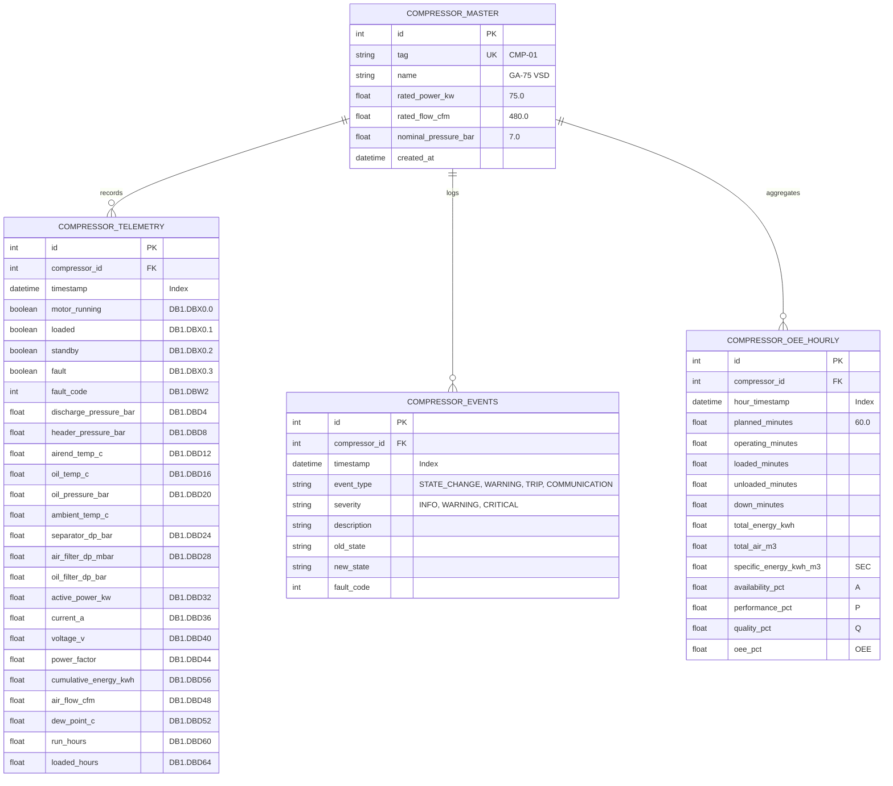
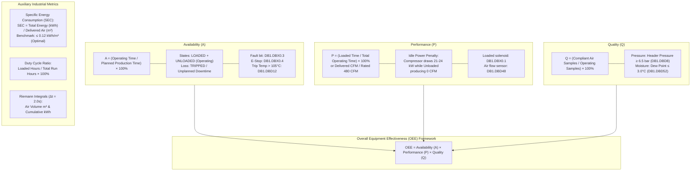
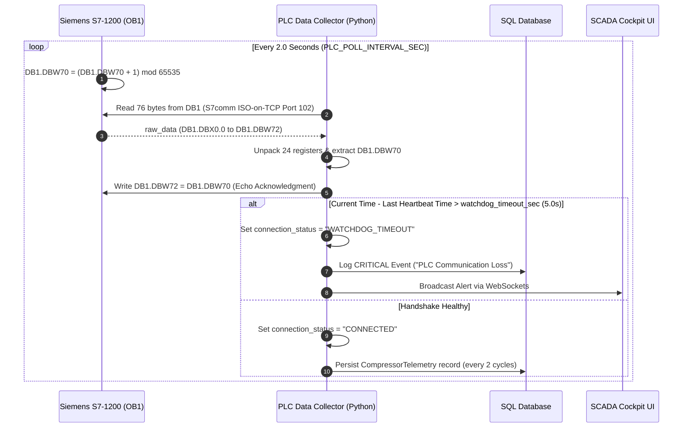

# Siemens S7-1200 Air Compressor OEE Data Dictionary & Engineering Calculations Guide

This document provides the authoritative technical reference and data dictionary for the **Air Compressor Management** system—a full-stack industrial SCADA, Overall Equipment Effectiveness (OEE) analytics, and local AI diagnostics platform for rotary screw air compressors connected to **Siemens S7-1200 PLCs** and **Microsoft SQL Server** (with automatic SQLite fallback).

---

## 📑 Table of Contents
1. [System Architecture & Equipment Specifications](#1-system-architecture--equipment-specifications)
2. [Section 1: Data Points & Tag Mapping Table](#section-1-data-points--tag-mapping-table)
   - [1.1 S7-1200 Data Block (DB1) Register Exchange Table](#11-s7-1200-data-block-db1-register-exchange-table)
   - [1.2 Database Persistence Schema Mapping](#12-database-persistence-schema-mapping)
   - [1.3 S7comm Driver, Watchdog Handshaking & Telemetry Ingestion](#13-s7comm-driver-watchdog-handshaking--telemetry-ingestion)
   - [1.4 Siemens TIA Portal Hardware & DB Configuration Rules](#14-siemens-tia-portal-hardware--db-configuration-rules)
3. [Section 2: OEE & Process Calculations Guide](#section-2-oee--process-calculations-guide)
   - [2.1 Availability ($A$) Calculation & State Modeling](#21-availability-a-calculation--state-modeling)
   - [2.2 Performance ($P$) Calculation & Screw Compressor Idle Loss](#22-performance-p-calculation--screw-compressor-idle-loss)
   - [2.3 Quality ($Q$) Calculation & Compressed Air Standards](#23-quality-q-calculation--compressed-air-standards)
   - [2.4 Overall OEE Formulation ($OEE = A \times P \times Q$)](#24-overall-oee-formulation-oee--a-times-p-times-q)
   - [2.5 Specific Energy Consumption (SEC) & Power Benchmarks](#25-specific-energy-consumption-sec--power-benchmarks)
   - [2.6 Cumulative Metric Integrations (Energy, Air Volume, Runtime)](#26-cumulative-metric-integrations-energy-air-volume-runtime)
   - [2.7 Differential Pressures, Filtration & Thermodynamic Diagnostics](#27-differential-pressures-filtration--thermodynamic-diagnostics)
   - [2.8 Watchdog Handshake & Connection Timeout Logic](#28-watchdog-handshake--connection-timeout-logic)
4. [Section 3: Codebase Cross-Reference Index](#section-3-codebase-cross-reference-index)

---

## 1. System Architecture & Equipment Specifications

### 1.1 Equipment Profile (Digital Twin & Physical Baseline)
As defined in [app/config.py](file:///c:/Users/anky_/Downloads/deletelater/com/air-compressor-management/app/config.py#L43-L56) and [app/database/models.py](file:///c:/Users/anky_/Downloads/deletelater/com/air-compressor-management/app/database/models.py#L9-L21):

| Engineering Parameter | Config Key | Nominal Value | Engineering Unit | Purpose |
| :--- | :--- | :--- | :--- | :--- |
| **Compressor Tag** | `COMPRESSOR_TAG` | `CMP-01` | String | Factory equipment identifier |
| **Compressor Name** | `COMPRESSOR_NAME` | Screw Compressor Unit #1 (GA-75 VSD) | String | Machine profile / model description |
| **Rated Motor Power** | `RATED_POWER_KW` | `75.0` | $\text{kW}$ | 100% full-load electrical design rating |
| **Rated Free Air Delivery (FAD)** | `RATED_FLOW_CFM` | `480.0` | $\text{CFM}$ ($13.59\ \text{m}^3/\text{min}$) | ISO 1217 Annex C rated capacity |
| **Target Load Pressure (Min)** | `TARGET_PRESSURE_MIN_BAR` | `6.50` | $\text{bar}$ ($94.27\ \text{PSI}$) | Cut-in reload threshold & Quality minimum |
| **Target Unload Pressure (Max)** | `TARGET_PRESSURE_MAX_BAR` | `7.50` | $\text{bar}$ ($108.78\ \text{PSI}$) | Cut-out unload threshold |
| **Nominal Header Pressure** | `nominal_pressure_bar` | `7.00` | $\text{bar}$ ($101.53\ \text{PSI}$) | Plant air ring main operating setpoint |
| **Airend Temp Normal Max** | `AIREND_TEMP_NORMAL_MAX_C` | `92.0` | $^\circ\text{C}$ | Top of normal operating thermal band |
| **Airend Temp Warning** | `AIREND_TEMP_WARN_C` | `98.0` | $^\circ\text{C}$ | Yellow warning threshold |
| **Airend Temp Trip** | `AIREND_TEMP_TRIP_C` | `105.0` | $^\circ\text{C}$ | Hard safety shutdown trip limit |
| **Separator Filter $\Delta P$ Warning** | `SEPARATOR_DP_WARN_BAR` | `0.80` | $\text{bar}$ | Element saturation replacement alert |
| **Air Filter $\Delta P$ Warning** | `air_filter_dp_mbar` | `25.0` (Warn: `>50.0`) | $\text{mbar}$ | Suction filter vacuum loss limit |
| **Pressure Dew Point Warning** | `MAX_DEWPOINT_WARN_C` | `3.0` | $^\circ\text{C}\ \text{PDP}$ | ISO 8573-1 Class 4 moisture limit |

```mermaid
flowchart TD
    subgraph Factory_Floor["Factory Floor / Field Level"]
        Compressor["Atlas Copco GA-75 VSD<br/>(Rotary Screw Element)"]
        FlowSensor["Thermal Mass Air Flow Sensor<br/>(CFM / m³/min)"]
        DewPoint["Chilled Mirror / Polymer Sensor<br/>(Pressure Dew Point °C)"]
        PowerMeter["Multi-Function Energy Meter<br/>(kW, kWh, V, A, cos φ)"]
    end

    subgraph Automation_Layer["Automation & Control Layer"]
        PLC["Siemens S7-1200 CPU<br/>(IP: 192.168.0.1, Rack 0, Slot 1)"]
        DB1["Shared Data Block: DB1<br/>76 Bytes Uncompressed Memory<br/>(DBX0.0 to DBW72)"]
    end

    subgraph Application_Layer["Application & Edge Analytics Layer (Python / FastAPI)"]
        Collector["PLC Data Collector Worker<br/>app/plc/collector.py<br/>(Cyclic Poll: 2.0s via S7comm)"]
        Twin["Physics Digital Twin Simulator<br/>app/plc/simulator.py<br/>(Thermodynamics & Pneumatics)"]
        Watchdog["Watchdog Heartbeat Handshake<br/>(DBW70 Counter ↔ DBW72 Echo)"]
        OEE["OEE Analytics Engine<br/>app/oee/engine.py<br/>(A, P, Q, OEE, SEC Calculations)"]
        DB[(MS SQL Server / SQLite Fallback<br/>app/database/models.py)]
        Agent["Local AI Diagnostics Agent<br/>app/chatbot/agent.py<br/>(Ollama / Expert Rule Engine)"]
    end

    subgraph Presentation_Layer["SCADA Presentation & User Interface"]
        SCADA["Real-Time SCADA Cockpit<br/>(WebSockets 1.5s, Canvas Strip Chart)"]
        PLCUI["PLC Diagnostics Page (/plc)<br/>(Live EKG Waveform, DB Inspector)"]
        DBUI["SQL Historian & CSV Exporter (/data)"]
    end

    Compressor -->|OEM Controller / Modbus RTU| PLC
    FlowSensor -->|4-20 mA Analog| PLC
    DewPoint -->|4-20 mA Analog| PLC
    PowerMeter -->|Modbus TCP / RTU| PLC
    PLC --- DB1
    DB1 <-->|S7comm ISO-on-TCP (Port 102)| Collector
    Twin -.->|When PLC_ENABLED=False| Collector
    Collector --> Watchdog
    Collector --> DB
    Collector --> OEE
    Collector -->|Live JSON| SCADA
    DB --> OEE
    DB --> Agent
    OEE --> SCADA
    OEE --> Agent
    Collector --> PLCUI
    DB --> DBUI
```

---

## Section 1: Data Points & Tag Mapping Table

### 1.1 S7-1200 Data Block (DB1) Register Exchange Table
The complete register mapping below is declared and verified in [app/plc/collector.py](file:///c:/Users/anky_/Downloads/deletelater/com/air-compressor-management/app/plc/collector.py#L251-L281), [app/plc/simulator.py](file:///c:/Users/anky_/Downloads/deletelater/com/air-compressor-management/app/plc/simulator.py#L135-L161), [app/api/plc_routes.py](file:///c:/Users/anky_/Downloads/deletelater/com/air-compressor-management/app/api/plc_routes.py#L43-L46), and [app/templates/plc.html](file:///c:/Users/anky_/Downloads/deletelater/com/air-compressor-management/app/templates/plc.html#L190-L206).

| Parameter / Variable Name | PLC Origin / Address | Data Type (PLC / App) | Direction | Unit | Meaning / Process Description | Collection Method / Source | Role in OEE |
| :--- | :--- | :--- | :--- | :--- | :--- | :--- | :--- |
| `motor_running` | `DB1.DBX0.0` | `BOOL` / `bool` | PLC $\rightarrow$ PC | $-$ | **Motor Running Feedback**: Auxiliary contact indicating the 75 kW main drive motor is energized and spinning. | Cyclic polling worker via S7comm read (`snap7.client.db_read(1, 0, 76)`) every $2.0\text{s}$. | **Availability ($A$)**: Fundamental numerator. Differentiates Operating Time from Down Time. |
| `loaded` | `DB1.DBX0.1` | `BOOL` / `bool` | PLC $\rightarrow$ PC | $-$ | **Loaded Solenoid State**: Indicates whether the compressor inlet poppet valve is open (compressing air) or closed (unloaded idle). | Cyclic polling worker via S7comm read every $2.0\text{s}$. | **Performance ($P$)**: Fundamental numerator. Differentiates useful compression time from non-productive idle time. |
| `standby` | `DB1.DBX0.2` | `BOOL` / `bool` | PLC $\rightarrow$ PC | $-$ | **Compressor Ready / Standby**: Machine is powered, interlocks clear, waiting for plant pressure to drop below cut-in threshold. | Cyclic polling worker via S7comm read every $2.0\text{s}$. | **Availability ($A$)**: Categorizes stopped state as planned auto-standby rather than an uncommanded failure. |
| `fault` | `DB1.DBX0.3` | `BOOL` / `bool` | PLC $\rightarrow$ PC | $-$ | **General Fault / Trip Flag**: Master trip alarm output latching any protective safety shutdown. | Cyclic polling worker via S7comm read every $2.0\text{s}$. | **Availability ($A$)**: Triggers immediate unplanned breakdown downtime state (`TRIPPED`). |
| `emergency_stop_healthy` | `DB1.DBX0.4` | `BOOL` / `bool` | PLC $\rightarrow$ PC | $-$ | **Emergency Stop Circuit Healthy**: Dual-channel safety loop monitor (`TRUE` = Circuit Closed / Normal; `FALSE` = E-Stop depressed). | Cyclic polling worker via S7comm read every $2.0\text{s}$. | **Availability ($A$)**: Safety circuit interlock trigger; forces machine to zero availability. |
| `fault_code` | `DB1.DBW2` | `INT` (16-bit) / `int` | PLC $\rightarrow$ PC | `ID` | **Active Trip Error Code**: Numerical diagnostic identifier from controller (e.g., `102` = Airend Over-Temperature Trip). | Cyclic polling worker via S7comm read every $2.0\text{s}$. | **Availability ($A$)**: Categorizes downtime loss reason in `CompressorEvent` table for Pareto downtime analysis. |
| `discharge_pressure_bar` | `DB1.DBD4` | `REAL` (IEEE 754) / `float` | PLC $\rightarrow$ PC | $\text{bar}$ | **Discharge Pressure**: Pneumatic pressure at the internal airend outlet before the minimum pressure check valve. | Cyclic polling worker via S7comm read every $2.0\text{s}$. | **Performance ($P$) & Threshold Trigger**: Governs the load/unload pressure cycle boundaries ($6.5 - 7.5\text{ bar}$). |
| `header_pressure_bar` | `DB1.DBD8` | `REAL` / `float` | PLC $\rightarrow$ PC | $\text{bar}$ | **Plant Header Pressure**: Regulated supply pressure downstream of the air receiver tank delivering air to factory ring main. | Cyclic polling worker via S7comm read every $2.0\text{s}$. | **Quality ($Q$)**: Main quality criteria. Must satisfy $P_{\text{header}} \ge 6.5\text{ bar}$ (`TARGET_PRESSURE_MIN_BAR`) for compliant air. |
| `airend_temp_c` | `DB1.DBD12` | `REAL` / `float` | PLC $\rightarrow$ PC | $^\circ\text{C}$ | **Airend Element Temperature**: PT100 temperature sensor reading at the screw compressor discharge port. | Cyclic polling worker via S7comm read every $2.0\text{s}$. | **Threshold Trigger**: Thermal safety limit. Warn: $>98^\circ\text{C}$, Trip: $>105^\circ\text{C}$. Overheating causes safety trips affecting Availability. |
| `oil_temp_c` | `DB1.DBD16` | `REAL` / `float` | PLC $\rightarrow$ PC | $^\circ\text{C}$ | **Oil Sump Temperature**: Lubricant reservoir temperature inside the air-oil receiver vessel. | Cyclic polling worker via S7comm read every $2.0\text{s}$. | **Auxiliary Metric**: Thermal condition monitoring (thermostatic valve opening efficiency at $71^\circ\text{C}$). |
| `oil_pressure_bar` | `DB1.DBD20` | `REAL` / `float` | PLC $\rightarrow$ PC | $\text{bar}$ | **Lube Oil Pressure**: Hydrodynamic pressure feeding lubricant to male/female rotor journal and thrust bearings ($3.4\text{ bar}$ normal). | Cyclic polling worker via S7comm read every $2.0\text{s}$. | **Availability ($A$) Trigger**: Pressure drop below $2.0\text{ bar}$ trips machine on low lubrication to prevent bearing seizure. |
| `separator_dp_bar` | `DB1.DBD24` | `REAL` / `float` | PLC $\rightarrow$ PC | $\text{bar}$ | **Air-Oil Separator Delta P ($\Delta P$)**: Pressure drop across coalescing air-oil separator filter ($0.2 - 0.4\text{ bar}$ normal). | Cyclic polling worker via S7comm read every $2.0\text{s}$. | **Performance / Energy Metric**: $\Delta P \ge 0.8\text{ bar}$ increases internal backpressure, raising motor power by $\approx 1\%$ per $0.1\text{ bar}$. |
| `air_filter_dp_mbar` | `DB1.DBD28` | `REAL` / `float` | PLC $\rightarrow$ PC | $\text{mbar}$ | **Air Intake Filter Delta P ($\Delta P$)**: Suction vacuum loss across intake air filter cartridge ($< 25\text{ mbar}$ normal). | Cyclic polling worker via S7comm read every $2.0\text{s}$. | **Performance ($P$) Trigger**: Dirty intake filter starves inlet air, degrading mass flow and compressor volumetric efficiency. |
| `active_power_kw` | `DB1.DBD32` | `REAL` / `float` | PLC $\rightarrow$ PC | $\text{kW}$ | **Total Active Power**: 3-Phase true electrical power draw measured by Siemens PAC3200 / Schneider power meter via Modbus to PLC. | Cyclic polling worker via S7comm read every $2.0\text{s}$. | **Energy Metric**: Full load ($\approx 71\text{ kW}$) vs Unload Idle ($\approx 22\text{ kW}$). Direct numerator for Specific Energy Consumption (SEC). |
| `current_a` | `DB1.DBD36` | `REAL` / `float` | PLC $\rightarrow$ PC | $\text{A}$ | **Average Motor Current**: Arithmetic mean of phase currents ($I_R, I_Y, I_B$) from the power meter. | Cyclic polling worker via S7comm read every $2.0\text{s}$. | **Auxiliary Metric**: Detects motor overload and phase current imbalance ($> 5\%$ causes stator winding overheating). |
| `voltage_v` | `DB1.DBD40` | `REAL` / `float` | PLC $\rightarrow$ PC | $\text{V}$ | **Line Voltage RMS**: 3-Phase line-to-line AC voltage ($415.0\text{ V}$ nominal). | Cyclic polling worker via S7comm read every $2.0\text{s}$. | **Auxiliary Metric**: Electrical grid quality check ($P = \sqrt{3} \times V \times I \times \cos\phi$). |
| `power_factor` | `DB1.DBD44` | `REAL` / `float` | PLC $\rightarrow$ PC | $-$ | **Motor Power Factor ($\cos\phi$)**: Ratio of real power to apparent power ($0.88 - 0.90$ loaded; $0.32 - 0.35$ unloaded). | Cyclic polling worker via S7comm read every $2.0\text{s}$. | **Performance ($P$) Proxy**: Low power factor highlights uncompressed idling energy waste. |
| `air_flow_cfm` | `DB1.DBD48` | `REAL` / `float` | PLC $\rightarrow$ PC | $\text{CFM}$ | **Delivered Air Flow**: Volumetric air output measured by in-line thermal mass flow meter ($480\text{ CFM}$ rated max). | Cyclic polling worker via S7comm read every $2.0\text{s}$. | **Performance ($P$) & Production**: Integrated to calculate total cubic meters of compressed air ($m^3$) delivered. |
| `dew_point_c` | `DB1.DBD52` | `REAL` / `float` | PLC $\rightarrow$ PC | $^\circ\text{C}\ \text{PDP}$ | **Pressure Dew Point**: Moisture content of compressed air downstream of refrigerated air dryer ($2.0 - 2.5^\circ\text{C}$ normal). | Cyclic polling worker via S7comm read every $2.0\text{s}$. | **Quality ($Q$)**: Must satisfy $\text{PDP} \le 3.0^\circ\text{C}$ (`MAX_DEWPOINT_WARN_C`) for ISO 8573-1 Class 4 compliance. |
| `cumulative_energy_kwh` | `DB1.DBD56` | `REAL` / `float` | PLC $\rightarrow$ PC | $\text{kWh}$ | **Cumulative Energy Consumed**: Running electrical energy totalizer accumulated in power meter / PLC registers. | Cyclic polling worker via S7comm read every $2.0\text{s}$. | **Energy Aggregation**: Numerator for windowed and shift Specific Energy Consumption (SEC). |
| `run_hours` | `DB1.DBD60` | `REAL` / `float` | PLC $\rightarrow$ PC | $\text{h}$ | **Total Operating Hours**: Cumulative counter tracking all hours where `motor_running == TRUE`. | Cyclic polling worker via S7comm read every $2.0\text{s}$. | **Availability ($A$)**: Long-term equipment operational counter and service interval tracking. |
| `loaded_hours` | `DB1.DBD64` | `REAL` / `float` | PLC $\rightarrow$ PC | $\text{h}$ | **Total Loaded Hours**: Cumulative counter tracking hours where air compression solenoid was actively energized. | Cyclic polling worker via S7comm read every $2.0\text{s}$. | **Performance ($P$)**: Long-term compressor duty ratio ($\text{Loaded Hours} / \text{Run Hours}$). |
| `plc_heartbeat_counter` | `DB1.DBW70` | `WORD` (16-bit uint) / `int` | PLC $\rightarrow$ PC | $\text{Cnt}$ | **PLC Heartbeat Counter (Watchdog)**: Free-running cyclic counter incremented in Siemens OB1 timer (0 to 65535). | Cyclic polling worker via S7comm read every $2.0\text{s}$. | **Availability Integrity**: Verifies PLC CPU program execution; triggers watchdog alarm if static for $> 5.0\text{s}$. |
| `app_echo_counter` | `DB1.DBW72` | `WORD` (16-bit uint) / `int` | PC $\rightarrow$ PLC | $\text{Cnt}$ | **PC Echo Acknowledgment (Handshake)**: Mirror acknowledgment value written back by Python application to PLC DB1. | Written back to PLC via S7comm write (`client.db_write(1, 72, echo_bytes)`). | **Bilateral Safety Handshake**: Enables PLC to detect application or PC server failure. |

---

### 1.2 Database Persistence Schema Mapping
All telemetry points above are mapped directly to relational database entities in [app/database/models.py](file:///c:/Users/anky_/Downloads/deletelater/com/air-compressor-management/app/database/models.py):



---

### 1.3 S7comm Driver, Watchdog Handshaking & Telemetry Ingestion

#### Physical Driver Interface (`python-snap7`)
When `PLC_ENABLED = True` in [app/config.py](file:///c:/Users/anky_/Downloads/deletelater/com/air-compressor-management/app/config.py#L31-L36), communication is handled over standard **ISO-on-TCP (RFC 1006 / Siemens S7comm)** on TCP Port 102 via `snap7`.
```python
# Production S7comm invocation structure (app/plc/collector.py lines 128-142)
import snap7
from snap7.util import get_bool, get_int, get_real, set_int

client = snap7.client.Client()
client.connect(settings.PLC_IP, settings.PLC_RACK, settings.PLC_SLOT)

# Reads 76 bytes covering DB1.DBX0.0 through DB1.DBW72 in a single atomic PDU
raw_data = client.db_read(settings.PLC_DB_NUMBER, 0, 76)

# Binary unpacking based on S7 byte offsets:
motor_running = get_bool(raw_data, byte_index=0, bool_index=0) # DB1.DBX0.0
loaded        = get_bool(raw_data, byte_index=0, bool_index=1) # DB1.DBX0.1
standby       = get_bool(raw_data, byte_index=0, bool_index=2) # DB1.DBX0.2
fault         = get_bool(raw_data, byte_index=0, bool_index=3) # DB1.DBX0.3
fault_code    = get_int(raw_data, byte_index=2)               # DB1.DBW2
discharge_p   = get_real(raw_data, byte_index=4)              # DB1.DBD4
header_p      = get_real(raw_data, byte_index=8)              # DB1.DBD8
airend_temp   = get_real(raw_data, byte_index=12)             # DB1.DBD12
active_power  = get_real(raw_data, byte_index=32)             # DB1.DBD32
air_flow      = get_real(raw_data, byte_index=48)             # DB1.DBD48
dew_point     = get_real(raw_data, byte_index=52)             # DB1.DBD52
plc_counter   = get_int(raw_data, byte_index=70)              # DB1.DBW70

# Echo back acknowledgment to DB1.DBW72
echo_bytes = bytearray(2)
set_int(echo_bytes, 0, plc_counter)
client.db_write(settings.PLC_DB_NUMBER, 72, echo_bytes)
```

#### Dual Database Ingestion & Fallback Logic
In [app/database/connection.py](file:///c:/Users/anky_/Downloads/deletelater/com/air-compressor-management/app/database/connection.py#L13-L65):
1. **Primary Target**: Microsoft SQL Server (`mssql+pyodbc`) using `ODBC Driver 17 for SQL Server` with Windows Authentication (`Trusted_Connection=yes`) or SQL credentials.
2. **Auto Fallback**: If MSSQL is unreachable or times out ($4\text{s}$ timeout check via `SELECT 1`), the system automatically switches to local SQLite (`sqlite:///data/compressor.db`) without process interruption or crashing.

---

### 1.4 Siemens TIA Portal Hardware & DB Configuration Rules
To enable proper data interchange between the physical Siemens S7-1200 CPU and this application, the following TIA Portal configuration rules must be applied (documented in [app/templates/plc.html](file:///c:/Users/anky_/Downloads/deletelater/com/air-compressor-management/app/templates/plc.html#L225-L260)):

1. **Permit PUT/GET Access in CPU Protection**:
   - In TIA Portal, open **Device Configuration** $\rightarrow$ select the **CPU 1214C / 1215C** $\rightarrow$ navigate to **Properties** $\rightarrow$ **Protection & Security** $\rightarrow$ **Connection mechanisms**.
   - Enable checkbox: *"Permit access with PUT/GET communication from remote partner"*.
   - *Failure to enable this causes S7comm Port 102 connections to be rejected with error `TCP Connection reset by peer` or `CLI: function refused by CPU`.*

2. **Disable "Optimized Block Access" for DB1**:
   - In project tree, right-click **DB1** $\rightarrow$ select **Properties** $\rightarrow$ **Attributes**.
   - **Uncheck** *"Optimized block access"*.
   - Recompile the DB. This forces standard fixed S7-300/400 legacy memory offsets (`DBX0.0`, `DBD4`, etc.), allowing external Snap7/S7comm drivers to address exact byte positions.

3. **PLC Heartbeat Logic in Main OB1**:
   - In Siemens TIA Portal `Main [OB1]`, implement cyclic incrementation of `DB1.DBW70`:
   ```scl
   // SCL code in OB1:
   "Clock_100ms_Pulse" := "Clock_Byte".%X0;
   IF "Clock_100ms_Pulse" THEN
       "DB1"."Heartbeat_Counter" := "DB1"."Heartbeat_Counter" + 1;
       IF "DB1"."Heartbeat_Counter" > 32767 THEN
           "DB1"."Heartbeat_Counter" := 0;
       END_IF;
   END_IF;
   ```

---

## Section 2: OEE & Process Calculations Guide



---

### 2.1 Availability ($A$) Calculation & State Modeling

#### Mathematical Definition
Availability evaluates the percentage of scheduled time that the air compressor is mechanically capable of operating without interruption from breakdowns, safety trips, or unscheduled downtime.

$$\text{Availability } (A) = \left( \frac{\text{Operating Time}}{\text{Planned Production Time}} \right) \times 100\%$$

#### Exact Code Implementation
Implemented in [app/oee/engine.py](file:///c:/Users/anky_/Downloads/deletelater/com/air-compressor-management/app/oee/engine.py#L46-L56) (Hourly Aggregates) and [app/oee/engine.py](file:///c:/Users/anky_/Downloads/deletelater/com/air-compressor-management/app/oee/engine.py#L104-L115) (Raw Telemetry Fallback):

**1. From Pre-Aggregated Hourly Records (`CompressorOEEHourly`):**
$$\text{Total Planned Minutes} = \sum_{i=1}^{N} \text{planned\_minutes}_i \quad (\text{default: } 60.0\ \text{min/hr})$$
$$\text{Total Operating Minutes} = \sum_{i=1}^{N} \text{operating\_minutes}_i$$
$$A = \begin{cases} 
\left( \frac{\text{Total Operating Minutes}}{\text{Total Planned Minutes}} \right) \times 100.0, & \text{if Total Planned Minutes} > 0 \\ 
100.0\%, & \text{otherwise} 
\end{cases}$$

**2. From Raw Sample Rows (`CompressorTelemetry`):**
$$A = \begin{cases} 
\left( \frac{N_{\text{motor\_running = True}}}{N_{\text{total\_samples}}} \right) \times 100.0, & \text{if } N_{\text{total\_samples}} > 0 \\ 
100.0\%, & \text{otherwise} 
\end{cases}$$

#### Machine State Determination Logic
In [app/plc/collector.py](file:///c:/Users/anky_/Downloads/deletelater/com/air-compressor-management/app/plc/collector.py#L144-L156) and [app/static/js/app.js](file:///c:/Users/anky_/Downloads/deletelater/com/air-compressor-management/app/static/js/app.js#L80-L110), operational states are evaluated hierarchically from PLC bits:

```python
# Evaluated every 2.0 seconds:
if fault == True or fault_code > 0:
    current_state = "TRIPPED"   # Unplanned Breakdown Downtime
elif loaded == True and motor_running == True:
    current_state = "LOADED"    # Productive Operating Time
elif motor_running == True and loaded == False:
    current_state = "UNLOADED"  # Idling Operating Time
else:
    current_state = "STOPPED"   # Auto-Restart Standby or Planned Off
```

#### Downtime and Loss Thresholds
1. **Unplanned Downtime (Breakdown Loss)**:
   - Triggered when `fault == True` (`DB1.DBX0.3`).
   - Triggered when `airend_temp_c >= 105.0` (`AIREND_TEMP_TRIP_C`), activating trip Fault Code `102`.
   - Triggered when Emergency Stop circuit opens (`emergency_stop_healthy == False` at `DB1.DBX0.4`).
   - Operating time ceases; `down_minutes` accumulates.
2. **Planned Downtime / Standby**:
   - Machine stopped on schedule or resting in pressure-satisfied auto-restart standby (`standby == True` at `DB1.DBX0.2`). Does not trigger critical breakdown alarms.

---

### 2.2 Performance ($P$) Calculation & Screw Compressor Idle Loss

#### Industrial Rotary Screw Idle Mechanics
Unlike reciprocating or variable-displacement equipment, a standard rotary screw compressor maintains its drive motor at full operational speed during the **unloaded (idling)** state while closing the intake poppet valve. During this time:
- Air Delivery: **$0.0\ \text{CFM}$** ($0.0\ \text{m}^3/\text{min}$).
- Power Consumption: **$21.0 - 24.0\ \text{kW}$** ($\approx 28\% - 32\%$ of rated $75\ \text{kW}$ power).
- Power Factor: Drops from $\approx 0.89$ down to $0.32 - 0.35$.

Consequently, excessive unloaded time is the single largest source of industrial energy waste. In this application, Performance ($P$) is structured to directly penalize non-productive unloaded idling.

#### Mathematical Formulation
Implemented in [app/oee/engine.py](file:///c:/Users/anky_/Downloads/deletelater/com/air-compressor-management/app/oee/engine.py#L58-L60) and [app/oee/engine.py](file:///c:/Users/anky_/Downloads/deletelater/com/air-compressor-management/app/oee/engine.py#L116):

**1. Raw Telemetry Duty-Ratio Formulation:**
$$P = \begin{cases} 
\left( \frac{N_{\text{loaded = True}}}{N_{\text{motor\_running = True}}} \right) \times 100.0, & \text{if } N_{\text{motor\_running = True}} > 0 \\ 
85.0\%, & \text{otherwise} 
\end{cases}$$

**2. Hourly Weighted Average Formulation:**
$$P = \begin{cases} 
\frac{\sum_{i=1}^{N} \left( \text{performance\_pct}_i \times \text{operating\_minutes}_i \right)}{\sum_{i=1}^{N} \text{operating\_minutes}_i}, & \text{if Total Operating Minutes} > 0 \\ 
85.0\%, & \text{otherwise} 
\end{cases}$$

Where each hourly record's performance in [app/database/seed_data.py](file:///c:/Users/anky_/Downloads/deletelater/com/air-compressor-management/app/database/seed_data.py#L64-L66) is governed by:
$$\text{performance\_pct}_i = \left( \frac{\text{loaded\_minutes}_i}{\text{operating\_minutes}_i} \right) \times 100.0 \times \eta_{\text{flow}}$$
$$\eta_{\text{flow}} = \frac{\text{Actual Delivered FAD}}{\text{Rated FAD (480 CFM)}} \approx 0.97 - 1.00$$

---

### 2.3 Quality ($Q$) Calculation & Compressed Air Standards

#### Quality Criteria for Industrial Compressed Air
In industrial compressed air networks, "Quality" does not produce scrap parts in the traditional discrete manufacturing sense; rather, air delivered out-of-spec can shut down production robots, ruin pharmaceutical batches, contaminate food lines, or corrode pneumatic cylinders.

The system evaluates two simultaneous quality gates:
1. **Pressure Stability Gate**: Plant header pressure must not drop below minimum process requirements:
   $$P_{\text{header}} \ge \text{TARGET\_PRESSURE\_MIN\_BAR} \quad (6.50\ \text{bar} \approx 94.3\ \text{PSI})$$
2. **Moisture / Dew Point Gate**: Moisture content must conform to **ISO 8573-1:2010 Class 4** standards:
   $$PDP \le \text{MAX\_DEWPOINT\_WARN\_C} \quad (3.0^\circ\text{C}\ \text{Pressure Dew Point})$$

#### Mathematical Formula
Implemented in [app/oee/engine.py](file:///c:/Users/anky_/Downloads/deletelater/com/air-compressor-management/app/oee/engine.py#L110-L117):

**1. Raw Telemetry Sample Evaluation:**
$$\text{Compliant Samples } (N_{\text{good}}) = \sum \Big[ \text{motor\_running} \land (P_{\text{header}} \ge 6.50\ \text{bar}) \land (PDP \le 3.0^\circ\text{C}) \Big]$$

$$Q = \begin{cases} 
\left( \frac{N_{\text{good}}}{N_{\text{motor\_running = True}}} \right) \times 100.0, & \text{if } N_{\text{motor\_running = True}} > 0 \\ 
99.0\%, & \text{otherwise} 
\end{cases}$$

**2. Hourly Weighted Average Formulation:**
$$Q = \begin{cases} 
\frac{\sum_{i=1}^{N} \left( \text{quality\_pct}_i \times \text{operating\_minutes}_i \right)}{\sum_{i=1}^{N} \text{operating\_minutes}_i}, & \text{if Total Operating Minutes} > 0 \\ 
99.0\%, & \text{otherwise} 
\end{cases}$$

---

### 2.4 Overall OEE Formulation ($OEE = A \times P \times Q$)

#### Overall OEE Multiplication
Implemented in [app/oee/engine.py](file:///c:/Users/anky_/Downloads/deletelater/com/air-compressor-management/app/oee/engine.py#L65) and [app/oee/engine.py](file:///c:/Users/anky_/Downloads/deletelater/com/air-compressor-management/app/oee/engine.py#L118):

$$\text{OEE} = \left( \frac{A}{100.0} \right) \times \left( \frac{P}{100.0} \right) \times \left( \frac{Q}{100.0} \right) \times 100.0$$

The final metric is normalized to a percentage $[0.0, 100.0]\%$ and rounded to 1 decimal place:
```python
oee = (avail / 100.0) * (perf / 100.0) * (qual / 100.0) * 100.0
oee_pct = round(oee, 1)
```

#### Industrial Benchmark Scale for Rotary Screw Compressors
- **$\text{OEE} \ge 85.0\%$**: **World Class**. Minimal breakdown downtime ($A \ge 98\%$), unloaded idling $< 12\%$ of operating time ($P \ge 88\%$), and stable air ring main pressure with dry air ($Q \ge 99\%$).
- **$75.0\% \le \text{OEE} < 85.0\%$**: **Acceptable Factory Baseline**. Typical for manufacturing plants with moderate load swings.
- **$\text{OEE} < 70.0\%$**: **Sub-Optimal / Energy Waste Alert**. Indicates excessive unloaded idle runtime (pneumatic air leaks or oversized compressor) or frequent low-pressure/moisture excursions.

---

### 2.5 Specific Energy Consumption (SEC) & Power Benchmarks

#### Formula and Definition
Specific Energy Consumption (SEC) measures the electrical energy needed to generate a standardized volume of compressed air:

$$\text{SEC} = \frac{\text{Total Electrical Energy Consumed } (\text{kWh})}{\text{Total Compressed Air Delivered } (\text{m}^3)}$$

Unit: $\text{kWh} / \text{m}^3$.

Implemented in [app/oee/engine.py](file:///c:/Users/anky_/Downloads/deletelater/com/air-compressor-management/app/oee/engine.py#L66) and [app/oee/engine.py](file:///c:/Users/anky_/Downloads/deletelater/com/air-compressor-management/app/oee/engine.py#L123):
```python
sec = (total_energy / total_air) if total_air > 0 else 0.11
sec_kwh_per_m3 = round(sec, 3)
```

#### Unit Conversions & Equivalent Metrics
In compressed air engineering, SEC is also commonly expressed in **Specific Power** terms ($kW / (\text{m}^3/\text{min})$ or $kW / 100\ \text{CFM}$):

1. **Conversion to $\text{kW} / (\text{m}^3/\text{min})$**:
   $$\text{Specific Power } \left[ \frac{\text{kW}}{\text{m}^3/\text{min}} \right] = \text{SEC } \left[ \frac{\text{kWh}}{\text{m}^3} \right] \times 60\ \frac{\text{min}}{\text{h}}$$
   *Example: An SEC of $0.110\ \text{kWh}/\text{m}^3$ equals $0.110 \times 60 = 6.60\ \text{kW} / (\text{m}^3/\text{min})$.*

2. **Conversion to $\text{kW} / 100\ \text{CFM}$**:
   Since $100\ \text{CFM} = 100 \times 0.0283168 = 2.83168\ \text{m}^3/\text{min}$:
   $$\text{Specific Power } \left[ \frac{\text{kW}}{100\ \text{CFM}} \right] = \text{SEC } \left[ \frac{\text{kWh}}{\text{m}^3} \right] \times 60 \times 2.83168 \approx \text{SEC} \times 169.9$$
   *Example: An SEC of $0.110\ \text{kWh}/\text{m}^3$ equals $0.110 \times 169.9 = 18.69\ \text{kW} / 100\ \text{CFM}$.*

3. **Status Classification in Code**:
   In [app/chatbot/agent.py](file:///c:/Users/anky_/Downloads/deletelater/com/air-compressor-management/app/chatbot/agent.py#L98-L100) and [app/static/js/app.js](file:///c:/Users/anky_/Downloads/deletelater/com/air-compressor-management/app/static/js/app.js#L311-L320):
   - $\text{SEC} \le 0.120\ \text{kWh}/\text{m}^3$: `OPTIMAL` (High compressor volumetric and electrical efficiency).
   - $\text{SEC} > 0.120\ \text{kWh}/\text{m}^3$: `ELEVATED` (Indicates excessive idle running, clogged separator filter, or downstream air leakage).

---

### 2.6 Cumulative Metric Integrations (Energy, Air Volume, Runtime)

#### Discrete Riemann Sum Integrations
Because telemetry is acquired periodically at interval $\Delta t = \text{settings.PLC\_POLL\_INTERVAL\_SEC} = 2.0\text{ seconds}$, cumulative process integrations in [app/oee/engine.py](file:///c:/Users/anky_/Downloads/deletelater/com/air-compressor-management/app/oee/engine.py#L121-L122) and [app/plc/simulator.py](file:///c:/Users/anky_/Downloads/deletelater/com/air-compressor-management/app/plc/simulator.py#L130) are calculated via Riemann sum:

1. **Total Energy Consumption ($\text{kWh}$)**:
   $$E_{\text{total}} = \sum_{k=1}^{N} \left( P_k \times \frac{\Delta t}{3600} \right)$$
   where $P_k = \text{active\_power\_kw}$ at sample $k$, and $\frac{\Delta t}{3600} = \frac{2.0}{3600}\ \text{hours}$.

2. **Total Air Volume Delivered ($\text{m}^3$)**:
   $$\text{Volume}_{\text{total}} = \sum_{k=1}^{N} \left( Q_{\text{flow}, k} \times 0.0283168 \times \frac{\Delta t}{60} \right)$$
   where $Q_{\text{flow}, k} = \text{air\_flow\_cfm}$ at sample $k$, $1\ \text{CFM} = 0.0283168\ \text{m}^3/\text{min}$, and $\frac{\Delta t}{60} = \frac{2.0}{60}\ \text{minutes}$.
   *Note: Conversion factor $1\ \text{CFM} = 1.69901\ \text{m}^3/\text{h}$.*

3. **Running Hours Accumulation ($\text{hours}$)**:
   In [app/plc/simulator.py](file:///c:/Users/anky_/Downloads/deletelater/com/air-compressor-management/app/plc/simulator.py#L77-L81):
   $$\text{run\_hours}_{t} = \text{run\_hours}_{t-\Delta t} + \frac{\Delta t}{3600} \quad (\text{if } \text{motor\_running} = \text{True})$$
   $$\text{loaded\_hours}_{t} = \text{loaded\_hours}_{t-\Delta t} + \frac{\Delta t}{3600} \quad (\text{if } \text{loaded} = \text{True})$$

4. **Duty Cycle Ratio ($\%$)**:
   In [app/static/js/app.js](file:///c:/Users/anky_/Downloads/deletelater/com/air-compressor-management/app/static/js/app.js#L158-L160):
   $$\text{Duty Ratio} = \left( \frac{\text{loaded\_hours}}{\text{run\_hours}} \right) \times 100\%$$

---

### 2.7 Differential Pressures, Filtration & Thermodynamic Diagnostics

#### 3-Phase Electrical Calculations
In [app/plc/simulator.py](file:///c:/Users/anky_/Downloads/deletelater/com/air-compressor-management/app/plc/simulator.py#L94) and [app/plc/simulator.py](file:///c:/Users/anky_/Downloads/deletelater/com/air-compressor-management/app/plc/simulator.py#L118):
$$\text{Current } (I) = \frac{P \times 1000}{\sqrt{3} \times V \times \cos\phi}$$
- Loaded State: $P \approx 71.0\ \text{kW}$, $V = 415.0\ \text{V}$, $\cos\phi = 0.89 \implies I \approx 110.8\ \text{A}$.
- Unloaded State: $P \approx 22.0\ \text{kW}$, $V = 415.0\ \text{V}$, $\cos\phi = 0.34 \implies I \approx 89.9\ \text{A}$.

#### Filter Differential Pressures ($\Delta P$)
In [app/chatbot/agent.py](file:///c:/Users/anky_/Downloads/deletelater/com/air-compressor-management/app/chatbot/agent.py#L162-L186):
1. **Air-Oil Separator Element $\Delta P$** (`DB1.DBD24`):
   - Normal: $0.20 - 0.40\ \text{bar}$.
   - Warning threshold: $\ge 0.80\ \text{bar}$ (`SEPARATOR_DP_WARN_BAR`).
   - Impact: Every $0.1\ \text{bar}$ increase across the separator requires $\approx 1\%$ additional motor active power for the same air volume and risks oil carryover into factory piping.
2. **Air Intake Filter $\Delta P$** (`DB1.DBD28`):
   - Normal clean: $< 25.0\ \text{mbar}$.
   - Clogged replacement alert: $> 50.0\ \text{mbar}$.
3. **Oil Filter $\Delta P$**:
   - Normal: $< 0.50\ \text{bar}$.
   - Bypass warning threshold: $> 1.20\ \text{bar}$.

#### Thermal Equilibrium & Overheat Trips
In [app/chatbot/agent.py](file:///c:/Users/anky_/Downloads/deletelater/com/air-compressor-management/app/chatbot/agent.py#L129-L160) and [app/config.py](file:///c:/Users/anky_/Downloads/deletelater/com/air-compressor-management/app/config.py#L51-L53):
$$\Delta T_{\text{cooler}} = T_{\text{airend}} - T_{\text{ambient}}$$
- Thermal Rise Model: $T_{\text{airend}} \rightarrow 89.0^\circ\text{C}$ (under full load compression).
- Sump Model: $T_{\text{oil}} = T_{\text{airend}} - 8.0^\circ\text{C}$.
- Warning limit: $98.0^\circ\text{C}$ (`AIREND_TEMP_WARN_C`).
- Safety trip limit: $105.0^\circ\text{C}$ (`AIREND_TEMP_TRIP_C`), triggers Fault Code `102`.

---

### 2.8 Watchdog Handshake & Connection Timeout Logic

#### Handshake Algorithm
Implemented in [app/plc/collector.py](file:///c:/Users/anky_/Downloads/deletelater/com/air-compressor-management/app/plc/collector.py#L99-L125) and [app/api/plc_routes.py](file:///c:/Users/anky_/Downloads/deletelater/com/air-compressor-management/app/api/plc_routes.py#L16-L42):



#### Watchdog Timeout Calculation
$$\Delta t_{\text{heartbeat}} = t_{\text{current}} - t_{\text{last\_heartbeat}}$$
$$\text{Status} = \begin{cases} 
\text{"WATCHDOG\_TIMEOUT"}, & \text{if } \text{handshake\_enabled} \land (\Delta t_{\text{heartbeat}} > \text{watchdog\_timeout\_sec}) \\ 
\text{"CONNECTED"}, & \text{if driver poll succeeds and } \Delta t_{\text{heartbeat}} \le \text{watchdog\_timeout\_sec} \\ 
\text{"DISCONNECTED"}, & \text{if socket connection refused or host unreachable} 
\end{cases}$$
Default timeout threshold is $5.0\text{s}$ (configurable from $1.0\text{s}$ to $60.0\text{s}$ via `POST /api/plc/handshake/config`).

---

## Section 3: Codebase Cross-Reference Index

This index provides direct navigation to every calculation, data model, communication driver, and API endpoint across the codebase:

| Metric / Functionality | Implementation Class & Method | Source Code File & Exact Location |
| :--- | :--- | :--- |
| **System Configurations & Thresholds** | `Settings` class | [app/config.py:L7-L58](file:///c:/Users/anky_/Downloads/deletelater/com/air-compressor-management/app/config.py#L7-L58) |
| **S7 Data Block Offset Map** | `PLCDataCollector.get_datapoints()` | [app/plc/collector.py:L251-L281](file:///c:/Users/anky_/Downloads/deletelater/com/air-compressor-management/app/plc/collector.py#L251-L281) |
| **S7 Cyclic Polling Loop** | `PLCDataCollector._poll_loop()` | [app/plc/collector.py:L58-L98](file:///c:/Users/anky_/Downloads/deletelater/com/air-compressor-management/app/plc/collector.py#L58-L98) |
| **Watchdog Heartbeat Handshake** | `PLCDataCollector._process_watchdog()` | [app/plc/collector.py:L99-L125](file:///c:/Users/anky_/Downloads/deletelater/com/air-compressor-management/app/plc/collector.py#L99-L125) |
| **State Transitions & Event Logging** | `PLCDataCollector._evaluate_state_transitions()` | [app/plc/collector.py:L144-L156](file:///c:/Users/anky_/Downloads/deletelater/com/air-compressor-management/app/plc/collector.py#L144-L156) |
| **Telemetry Persistence** | `PLCDataCollector._persist_telemetry()` | [app/plc/collector.py:L179-L217](file:///c:/Users/anky_/Downloads/deletelater/com/air-compressor-management/app/plc/collector.py#L179-L217) |
| **Port 102 Socket Probing** | `PLCDataCollector.probe_connection()` | [app/plc/collector.py:L218-L250](file:///c:/Users/anky_/Downloads/deletelater/com/air-compressor-management/app/plc/collector.py#L218-L250) |
| **Digital Twin Physics Simulator** | `CompressorSimulator.tick()` | [app/plc/simulator.py:L61-L161](file:///c:/Users/anky_/Downloads/deletelater/com/air-compressor-management/app/plc/simulator.py#L61-L161) |
| **OEE Window Calculation (Hourly & Telemetry)** | `OEEEngine.calculate_window_oee()` | [app/oee/engine.py:L32-L140](file:///c:/Users/anky_/Downloads/deletelater/com/air-compressor-management/app/oee/engine.py#L32-L140) |
| **OEE Hourly Trend Queries** | `OEEEngine.get_hourly_trend()` | [app/oee/engine.py:L142-L170](file:///c:/Users/anky_/Downloads/deletelater/com/air-compressor-management/app/oee/engine.py#L142-L170) |
| **Database Models & ORM Schema** | `Base`, `CompressorMaster`, `CompressorTelemetry`, `CompressorEvent`, `CompressorOEEHourly` | [app/database/models.py:L7-L110](file:///c:/Users/anky_/Downloads/deletelater/com/air-compressor-management/app/database/models.py#L7-L110) |
| **MSSQL Engine & SQLite Fallback** | `create_db_engine()` | [app/database/connection.py:L13-L65](file:///c:/Users/anky_/Downloads/deletelater/com/air-compressor-management/app/database/connection.py#L13-L65) |
| **Realistic Shift Seeding Math** | `seed_initial_data_if_empty()` | [app/database/seed_data.py:L11-L163](file:///c:/Users/anky_/Downloads/deletelater/com/air-compressor-management/app/database/seed_data.py#L11-L163) |
| **OEE Summary REST Endpoint** | `GET /api/oee/summary` | [app/api/routes.py:L70-L88](file:///c:/Users/anky_/Downloads/deletelater/com/air-compressor-management/app/api/routes.py#L70-L88) |
| **Live Telemetry REST Endpoint** | `GET /api/telemetry/live` | [app/api/routes.py:L42-L46](file:///c:/Users/anky_/Downloads/deletelater/com/air-compressor-management/app/api/routes.py#L42-L46) |
| **Historical Telemetry Endpoint** | `GET /api/telemetry/history` | [app/api/routes.py:L47-L69](file:///c:/Users/anky_/Downloads/deletelater/com/air-compressor-management/app/api/routes.py#L47-L69) |
| **PLC Status & Watchdog API** | `GET /api/plc/status` | [app/api/plc_routes.py:L16-L42](file:///c:/Users/anky_/Downloads/deletelater/com/air-compressor-management/app/api/plc_routes.py#L16-L42) |
| **PLC Datapoints API** | `GET /api/plc/datapoints` | [app/api/plc_routes.py:L43-L47](file:///c:/Users/anky_/Downloads/deletelater/com/air-compressor-management/app/api/plc_routes.py#L43-L47) |
| **Database Filtering & KPIs API** | `GET /api/data/records` | [app/api/data_routes.py:L278-L342](file:///c:/Users/anky_/Downloads/deletelater/com/air-compressor-management/app/api/data_routes.py#L278-L342) |
| **CSV Streaming Export API** | `GET /api/data/export/csv` | [app/api/data_routes.py:L344-L400](file:///c:/Users/anky_/Downloads/deletelater/com/air-compressor-management/app/api/data_routes.py#L344-L400) |
| **Real-Time WebSocket Broadcaster** | `ConnectionManager.broadcast_telemetry()` | [app/api/websocket.py:L24-L37](file:///c:/Users/anky_/Downloads/deletelater/com/air-compressor-management/app/api/websocket.py#L24-L37) |
| **Expert Heuristic Diagnostic Engine** | `CompressorDiagnosticAgent._heuristic_diagnostics()` | [app/chatbot/agent.py:L69-L96](file:///c:/Users/anky_/Downloads/deletelater/com/air-compressor-management/app/chatbot/agent.py#L69-L96) |
| **OEE & SEC Natural Language Analysis** | `CompressorDiagnosticAgent._diagnose_oee()` | [app/chatbot/agent.py:L97-L128](file:///c:/Users/anky_/Downloads/deletelater/com/air-compressor-management/app/chatbot/agent.py#L97-L128) |
| **Thermal Diagnostics & Oil Health** | `CompressorDiagnosticAgent._diagnose_temperature()` | [app/chatbot/agent.py:L129-L160](file:///c:/Users/anky_/Downloads/deletelater/com/air-compressor-management/app/chatbot/agent.py#L129-L160) |
| **Mechanical Health & Differential Pressures** | `CompressorDiagnosticAgent._diagnose_health()` | [app/chatbot/agent.py:L162-L187](file:///c:/Users/anky_/Downloads/deletelater/com/air-compressor-management/app/chatbot/agent.py#L162-L187) |
| **Application Lifespan & Startup Routines** | `lifespan(app: FastAPI)` | [run.py:L29-L55](file:///c:/Users/anky_/Downloads/deletelater/com/air-compressor-management/run.py#L29-L55) |
| **Automated Verification Suite** | `run_tests()` | [test_verification.py:L23-L216](file:///c:/Users/anky_/Downloads/deletelater/com/air-compressor-management/test_verification.py#L23-L216) |
