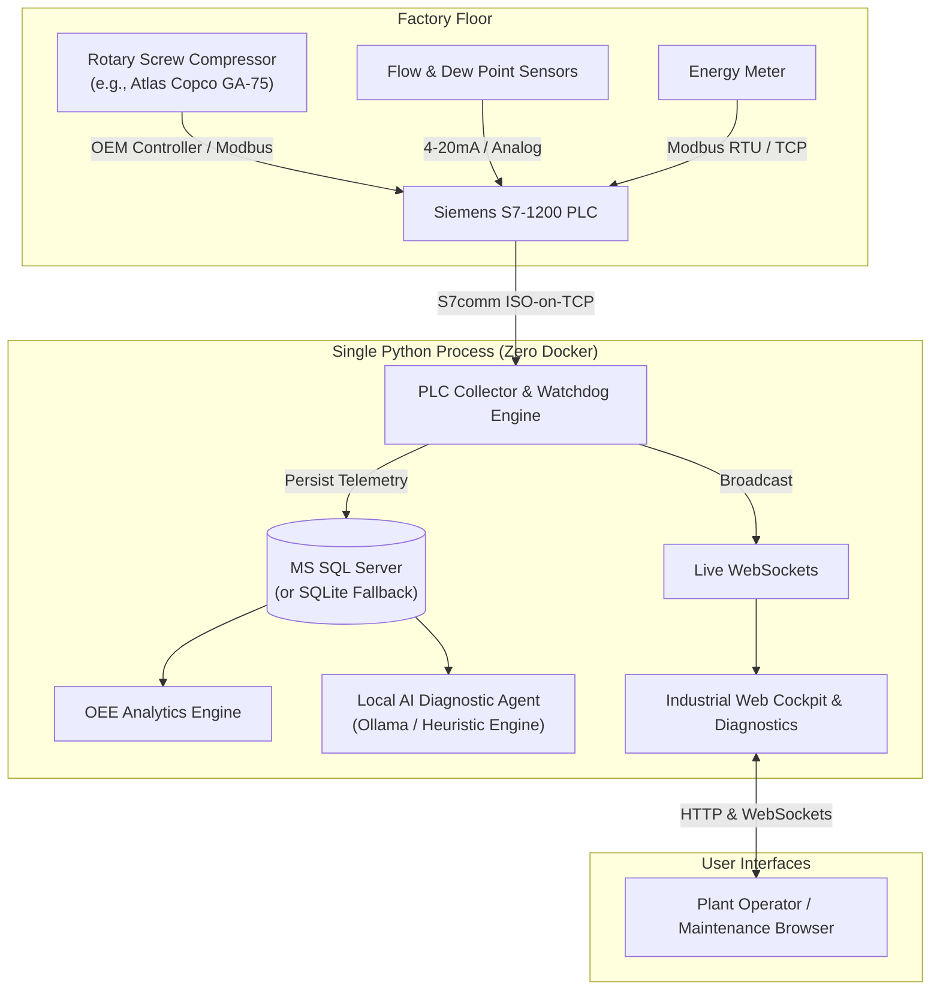

# Air Compressor Management

An industrial monitoring, OEE (Overall Equipment Effectiveness) analytics, and local AI health diagnostics application for rotary screw air compressors connected to **Siemens S7-1200 PLCs** and **Microsoft SQL Server**.

---

## 🌟 Key Features

- **Zero External Dependencies**: Single-process Python architecture. **No Docker, No Node.js, and No Redis required**.
- **Real-Time SCADA Cockpit**: High-contrast industrial dark-mode interface with live SVG radial gauges, range meters, and a 60-second scrolling Canvas strip-chart updating via sub-second WebSockets.
- **True Air Compressor OEE Engine**:
  - **Availability**: Machine uptime vs. scheduled operating time.
  - **Performance**: Delivered air flow ratio and loaded vs. unloaded idle loss tracking (detects the 20%–35% power wasted during screw compressor idle).
  - **Quality**: Air delivery within required pressure band ($6.5 - 7.5\text{ bar}$) and pressure dew point moisture limits ($\le 3.0^\circ\text{C}$).
  - **Specific Energy Consumption (SEC)**: Real-time efficiency calculated as $\text{kWh} / m^3$.
- **Dedicated Siemens S7-1200 Diagnostics Page (`/plc`)**:
  - Full Data Block (DB) mapping for 24 registers (`DB1.DBX0.0` through `DB1.DBD64`).
  - Active **Cyclic Watchdog Handshaking** (`DB1.DBW70` PLC counter $\leftrightarrow$ `DB1.DBW72` PC Echo).
  - Real-time EKG-style Heartbeat waveform monitor and watchdog countdown timer.
  - S7comm ISO-on-TCP (Port 102) active socket probing and disconnection alarms.
- **100% Offline Local AI Diagnostics Chatbot**:
  - Works with local **Ollama** (`llama3.2`, `qwen2.5`, etc.).
  - Includes a built-in **Industrial Reliability Rules Engine fallback** that analyzes live SQL telemetry even without Ollama or internet connection.
- **Dual-Mode Database Support**:
  - Connects to **MS SQL Server** using ODBC Driver 17/18.
  - Automatically falls back to local SQLite if MSSQL is offline, ensuring the app never crashes.
- **Digital Twin Simulator**:
  - Realistic rotary screw compressor thermodynamics, load/unload pressure cycles, and electrical power curves for offline testing before wiring physical hardware.

---

## 🏗️ System Architecture



---

## 📋 S7-1200 Data Block (DB1) Register Mapping

| DB Offset | Parameter Name | Type | Direction | Unit | Description |
| :--- | :--- | :--- | :--- | :--- | :--- |
| `DB1.DBX0.0` | Motor Running | `BOOL` | PLC $\rightarrow$ PC | - | Motor auxiliary feedback |
| `DB1.DBX0.1` | Loaded Solenoid | `BOOL` | PLC $\rightarrow$ PC | - | Intake valve open / closed |
| `DB1.DBX0.2` | Standby Ready | `BOOL` | PLC $\rightarrow$ PC | - | Auto-restart standby |
| `DB1.DBX0.3` | General Trip Flag | `BOOL` | PLC $\rightarrow$ PC | - | High-priority safety trip |
| `DB1.DBX0.4` | Emergency Stop | `BOOL` | PLC $\rightarrow$ PC | - | Safety loop healthy |
| `DB1.DBW2` | Error Code | `INT` | PLC $\rightarrow$ PC | ID | Active alarm fault ID |
| `DB1.DBD4` | Discharge Pressure | `REAL` | PLC $\rightarrow$ PC | bar | Compressor head pressure |
| `DB1.DBD8` | Header Pressure | `REAL` | PLC $\rightarrow$ PC | bar | Plant supply pressure |
| `DB1.DBD12` | Airend Temperature | `REAL` | PLC $\rightarrow$ PC | °C | Compression element temperature |
| `DB1.DBD16` | Oil Temperature | `REAL` | PLC $\rightarrow$ PC | °C | Lubricant temperature |
| `DB1.DBD20` | Oil Pressure | `REAL` | PLC $\rightarrow$ PC | bar | Bearing lube feed pressure |
| `DB1.DBD24` | Separator $\Delta P$ | `REAL` | PLC $\rightarrow$ PC | bar | Air-oil separator clogging |
| `DB1.DBD28` | Air Filter $\Delta P$ | `REAL` | PLC $\rightarrow$ PC | mbar | Air intake filter clogging |
| `DB1.DBD32` | Active Power | `REAL` | PLC $\rightarrow$ PC | kW | Real-time electrical draw |
| `DB1.DBD36` | Motor Current | `REAL` | PLC $\rightarrow$ PC | A | Phase loading |
| `DB1.DBD40` | Line Voltage | `REAL` | PLC $\rightarrow$ PC | V | 3-Phase RMS voltage |
| `DB1.DBD44` | Power Factor | `REAL` | PLC $\rightarrow$ PC | - | $\cos \phi$ electrical efficiency |
| `DB1.DBD48` | Delivered Air Flow | `REAL` | PLC $\rightarrow$ PC | CFM | Volumetric air delivery |
| `DB1.DBD52` | Pressure Dew Point | `REAL` | PLC $\rightarrow$ PC | °C | Dryer moisture content |
| `DB1.DBD56` | Cumulative Energy | `REAL` | PLC $\rightarrow$ PC | kWh | Total energy consumed |
| `DB1.DBD60` | Run Hours | `REAL` | PLC $\rightarrow$ PC | h | Total operating hours |
| `DB1.DBD64` | Loaded Hours | `REAL` | PLC $\rightarrow$ PC | h | Compressing hours |
| `DB1.DBW70` | **PLC Heartbeat Counter** | `WORD` | PLC $\rightarrow$ PC | Cnt | Cyclic watchdog counter |
| `DB1.DBW72` | **PC Echo Acknowledgment** | `WORD` | PC $\rightarrow$ PLC | Cnt | Handshake acknowledgment |

---

## 🚀 Quick Start

### 1. Installation
Ensure Python 3.11+ is installed:
```bash
git clone https://github.com/anky-mthegem/air-compressor-management.git
cd air-compressor-management
pip install -r requirements.txt
```

### 2. Run the Application
```bash
# Windows
start_app.bat
# or
python run.py
```

### 3. Open in Browser
- **Overview Cockpit**: `http://localhost:8000/`
- **PLC Diagnostics & Data Points**: `http://localhost:8000/plc`
- **Interactive Swagger API Docs**: `http://localhost:8000/docs`

---

## ⚙️ Configuration (`.env`)

Copy `.env.example` to `.env` to configure your factory hardware:
```ini
# Database:
DB_TYPE=mssql
MSSQL_SERVER=localhost\SQLEXPRESS
MSSQL_DATABASE=CompressorDB
MSSQL_DRIVER=ODBC Driver 17 for SQL Server

# Siemens S7-1200 PLC:
PLC_ENABLED=True
PLC_IP=192.168.0.1
PLC_RACK=0
PLC_SLOT=1
PLC_DB_NUMBER=1

# Local Ollama AI:
OLLAMA_BASE_URL=http://localhost:11434
OLLAMA_MODEL=llama3.2
```

---

## 📄 License
MIT License.
