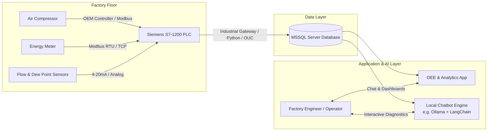

# Air Compressor OEE & Health Monitoring System
## Project Specification & Technical Design Notes

---

## 1. Project Overview & Architecture

### High-Level Concept
Build an end-to-end industrial monitoring and intelligence system for an industrial air compressor in a factory:
1. **Edge Acquisition**: Siemens S7-1200 PLC collects sensor data, parameters, status bits, and electrical measurements from the compressor and auxiliary instrumentation.
2. **Central Storage**: Telemetry, events, and maintenance logs are pushed to a Microsoft SQL Server (MSSQL) database.
3. **Analytics Engine (Application)**: Calculates real-time and historical **OEE (Overall Equipment Effectiveness)**, Specific Energy Consumption (SEC), and uptime statistics.
4. **Local AI Diagnostics Chatbot**: A local LLM agent connected to MSSQL that answers queries regarding machine health, efficiency anomalies, operational problems, and root-cause analysis without sending factory data to the cloud.

---

## 2. OEE Formula & Concept for Industrial Compressors

$$\text{OEE} = \text{Availability (A)} \times \text{Performance (P)} \times \text{Quality (Q)}$$

### A. Availability ($A$)
Measures machine uptime versus planned operating time.
- **Formula**:
  $$\text{Availability} = \frac{\text{Actual Operating Time (Loaded + Idle)}}{\text{Planned Production Time}}$$
- **Unplanned Losses**: Emergency stops, motor trip (overload), high discharge temperature trips, phase imbalance, mechanical breakdown.
- **Planned Downtime**: Oil change, air/oil filter replacement, separator servicing, valve overhauls.

### B. Performance ($P$)
Measures the operational efficiency and utilization of the compressor while running.
- **Formula Option 1 (Flow Delivery Ratio)**:
  $$\text{Performance} = \frac{\text{Actual Delivered Air Volume } (m^3 \text{ or } CFM)}{\text{Design Rated Capacity at Operating Pressure}}$$
- **Formula Option 2 (Duty Cycle Efficiency / Loaded Ratio)**:
  $$\text{Loaded Efficiency Ratio} = \frac{\text{Time Running Loaded}}{\text{Total Running Time (Loaded + Unloaded)}}$$
  *Note: A screw compressor running unloaded consumes 20%–40% of full-load power without delivering compressed air. High unloaded run time significantly hurts factory efficiency.*
- **Key Benchmark**: Specific Energy Consumption (SEC) in $kW / (m^3/\text{min})$ or $kWh / 100\text{ CFM}$.

### C. Quality ($Q$)
In compressed air systems, "Quality" represents delivery within the required pressure band and moisture/cleanliness tolerances.
- **Formula**:
  $$\text{Quality} = \frac{\text{Total Operating Time} - \text{Out-of-Spec Time}}{\text{Total Operating Time}}$$
  *or*
  $$\text{Quality} = \frac{\text{Air Volume Delivered within Pressure & Dew Point Spec}}{\text{Total Air Volume Delivered}}$$
- **Quality Defects**:
  1. **Pressure Sag**: Header pressure drops below minimum required line pressure (e.g. $< 6.0\text{ bar}$), starving pneumatic equipment or causing production line stoppages.
  2. **High Moisture / High Dew Point**: Refrigerated/desiccant dryer failure causing wet air (risks corroding pneumatic tools or ruining paint applications).
  3. **High Oil Carryover**: Failed separator filter leaking oil droplets into plant lines.

---

## 3. Data & Parameters to Capture from Compressor

### 3.1 Digital States & Status Flags (Availability & Cycles)
| Parameter Name | Data Type | Source | Purpose |
| :--- | :--- | :--- | :--- |
| **Motor Running** | Boolean | S7-1200 DI / Modbus | Tracks whether main motor is energized. |
| **Loaded Status** | Boolean | S7-1200 DI / Modbus | True = Intake valve open / compressing air; False = Unloaded (idling). |
| **Ready / Standby Mode** | Boolean | Modbus | True = Auto-restart ready; waiting for pressure drop. |
| **General Fault / Trip** | Boolean | S7-1200 DI / Modbus | High-priority alarm indicating machine has tripped. |
| **Emergency Stop** | Boolean | S7-1200 Safety / DI | Safety circuit tripped. |
| **Fault Code / Error ID** | Integer | Modbus | Exact diagnostic error code from internal controller. |
| **Motor Start Counter** | Integer (Count) | PLC Counter / Modbus | Detects excessive motor start cycles (>4–6 starts/hr can overheat motor). |
| **Total Run Hours** | Float (Hours) | Modbus | Cumulative runtime counter. |
| **Total Loaded Hours** | Float (Hours) | Modbus | Cumulative loaded time counter. |

---

### 3.2 Pressures & Temperatures (Performance & Condition Monitoring)
| Parameter Name | Normal Range | Critical Threshold | Purpose |
| :--- | :--- | :--- | :--- |
| **Discharge Pressure** | 6.5 – 8.5 bar (plant dependent) | High trip: > 9.0 bar | Measures compressor head pressure. |
| **Header / Tank Pressure** | 6.0 – 7.5 bar | Low alarm: < 5.8 bar | Measures actual delivery pressure supplied to factory. |
| **Airend Discharge Temp** | 78°C – 92°C | Warning: > 98°C, Trip: > 105°C | Core health indicator. Overheating indicates oil degradation, low oil, or cooler clogging. |
| **Oil Temperature** | 65°C – 85°C | High: > 95°C | Checks thermal stability of lubricant. |
| **Oil Pressure** | 2.5 – 5.0 bar | Low: < 2.0 bar | Protects screw bearings and compression element. |
| **Ambient Air Temp** | 20°C – 35°C | High: > 42°C | High ambient air reduces mass flow capacity and cooling capacity. |

---

### 3.3 Differential Pressures ($\Delta P$ - Filter Clogging & Predictive Maintenance)
| Parameter Name | Nominal ($\Delta P$) | Clogged Warning ($\Delta P$) | Chatbot Diagnostic Value |
| :--- | :--- | :--- | :--- |
| **Air Intake Filter $\Delta P$** | < 25 mbar | > 50 mbar | Restricted inlet starves air intake, wasting motor power. |
| **Oil Filter $\Delta P$** | < 0.5 bar | > 1.2 bar | High $\Delta P$ risks oil starvation to airend screws. |
| **Air-Oil Separator $\Delta P$** | 0.2 – 0.4 bar | > 0.8 – 1.0 bar | Dirty separator creates backpressure, spikes power draw, and causes oil carryover. |

---

### 3.4 Electrical Parameters (Power, Energy & Motor Health)
*Best captured by integrating a 3-Phase Multi-Function Energy Meter into S7-1200 via Modbus.*
| Parameter Name | Unit | Diagnostic Purpose |
| :--- | :--- | :--- |
| **Active Power ($P$)** | kW | Real-time electrical power draw; used directly for SEC calculation. |
| **Cumulative Energy** | kWh | Total energy consumed for daily/shift OEE and energy cost tracking. |
| **Phase Currents ($I_R, I_Y, I_B$)** | A | Detects phase imbalance (>5% imbalance causes motor stator winding burnout). |
| **Phase Voltages ($V_{RY}, V_{YB}, V_{BR}$)** | V | Detects undervoltage / overvoltage conditions. |
| **Power Factor ($\cos \phi$)** | 0.0 – 1.0 | Indicates motor loading efficiency (unloaded motors show very low PF: 0.2–0.4). |

---

### 3.5 Air Quality & Output Metrics
| Parameter Name | Unit | Diagnostic Purpose |
| :--- | :--- | :--- |
| **Air Flow Rate** | $m^3/\text{min}$ or $CFM$ | Measures actual production rate of compressed air. |
| **Pressure Dew Point (PDP)** | °C PDP (e.g. +3°C for ref. dryer) | Measures moisture in compressed air; detects dryer failure. |

---

## 4. Siemens S7-1200 Acquisition Strategy

### A. Communication with Existing Compressor Controller
Modern industrial screw compressors (e.g., Atlas Copco *Elektronikon*, Ingersoll Rand *Xe-Series*, Kaeser *Sigma Control*, BOGE, Sullair) include built-in RS-485 or Ethernet ports:
- **Siemens S7-1200 with CM 1241 (RS422/485 module)**: Polls the compressor controller via **Modbus RTU** (`MB_COMM_LOAD` & `MB_MASTER` function blocks in TIA Portal).
- **Siemens S7-1200 PROFINET Port**: Can read via **Modbus TCP** if the controller supports Ethernet.
- *Advantage*: Extracts temperatures, internal pressures, running hours, and exact alarm codes directly without needing to install intrusive sensors.

### B. Auxiliary Hardwired I/O
For parameters not accessible via the internal controller:
- **Analog Inputs (SM 1231 4–20 mA)**: Header pressure transmitter, thermal mass flow meter, dew point sensor.
- **RTD Inputs (SM 1231 RTD)**: Airend / discharge PT100 temperature sensors.
- **Digital Inputs**: Motor auxiliary contact (run feedback), trip relay contact, emergency stop feedback.

### C. Electrical Energy Meter
- Connect a multi-function power meter (e.g., Siemens PAC3200 / Schneider PM5000 series) to S7-1200 via Modbus RTU or TCP to record true kW, kWh, Amps, and Volts.

---

## 5. Bridging S7-1200 to MS SQL Server

Options to stream PLC data into MSSQL:
1. **Lightweight Python / C# Collector Service (Recommended)**:
   - Uses `snap7` / `python-snap7` or `pyModbus` to poll DB blocks in the S7-1200 every 2–5 seconds.
   - Pushes clean records to MSSQL using `pyodbc` or `SQLAlchemy`.
2. **Industrial Edge Gateway (Node-RED)**:
   - Uses `node-red-contrib-s7` to read PLC DB registers and `node-red-contrib-mssql-plus` to insert into MSSQL.
3. **Direct PLC-to-SQL (Siemens OUC / TCON)**:
   - Siemens provides a library ("LSQL") that enables S7-1200/1500 to send native TDS (Tabular Data Stream) packets directly to MSSQL without a middleman PC.

---

## 6. Proposed MSSQL Database Schema Structure

### Table 1: `Compressor_Telemetry_Raw` (Time-Series Data, Sampled every 5–10 sec)
- `Id` (BIGINT, PK, Identity)
- `CompressorId` (INT, FK)
- `Timestamp` (DATETIME2(3))
- `MotorRunning` (BIT)
- `Loaded` (BIT)
- `DischargePressure_Bar` (DECIMAL(5,2))
- `HeaderPressure_Bar` (DECIMAL(5,2))
- `AirendTemp_C` (DECIMAL(5,2))
- `ActivePower_kW` (DECIMAL(6,2))
- `Current_Avg_A` (DECIMAL(5,2))
- `AirFlow_CFM` (DECIMAL(7,2))
- `DewPoint_C` (DECIMAL(5,2))
- `Separator_DiffPressure_Bar` (DECIMAL(4,2))

### Table 2: `Compressor_Events_Log` (State Changes & Alarms)
- `EventId` (BIGINT, PK, Identity)
- `CompressorId` (INT)
- `EventTimestamp` (DATETIME2(3))
- `EventType` (NVARCHAR(30)) -- 'STATE_CHANGE', 'ALARM_WARNING', 'TRIP_FAULT', 'MAINTENANCE'
- `OldState` (NVARCHAR(30))
- `NewState` (NVARCHAR(30))
- `FaultCode` (INT)
- `FaultDescription` (NVARCHAR(255))
- `Duration_Seconds` (INT)

### Table 3: `Compressor_OEE_Hourly` (Pre-Aggregated Calculations)
- `OeeRecordId` (BIGINT, PK)
- `CompressorId` (INT)
- `HourStart` (DATETIME2(0))
- `PlannedTime_Minutes` (DECIMAL(5,2))
- `OperatingTime_Minutes` (DECIMAL(5,2))
- `LoadedTime_Minutes` (DECIMAL(5,2))
- `UnloadedTime_Minutes` (DECIMAL(5,2))
- `TotalEnergy_kWh` (DECIMAL(8,2))
- `TotalAirProduced_m3` (DECIMAL(10,2))
- `SpecificEnergy_kWh_per_m3` (DECIMAL(6,3))
- `Availability_Pct` (DECIMAL(5,2))
- `Performance_Pct` (DECIMAL(5,2))
- `Quality_Pct` (DECIMAL(5,2))
- `OEE_Pct` (DECIMAL(5,2))

---

## 7. Local Diagnostic Chatbot Design (RAG & NL-to-SQL)

### Core Architecture
- **LLM Runner**: Local engine such as **Ollama** (running models like *Llama 3*, *Mistral*, or *Qwen 2.5*) ensuring zero data leaves factory network.
- **Agent Framework**: LangChain / LlamaIndex or native Python tool-calling agent.
- **Capabilities**:
  1. **Text-to-SQL Tool**: Translates user questions into parameterized SQL queries against `Compressor_OEE_Hourly` and `Compressor_Telemetry_Raw`.
  2. **Rule-Based Diagnostic Knowledge Base**: Includes OEM troubleshooting guides, threshold limits, and component failure patterns.

### Sample Chatbot Interaction Scenarios
- **Efficiency Analysis**:
  - *User*: "Why did OEE fall to 64% during the night shift?"
  - *Chatbot*: "Analysis of Night Shift (22:00 - 06:00): Availability was 98%, but Performance dropped to 67%. The compressor was running unloaded for 4.2 hours out of 8 hours, consuming 48 kWh of idling power without producing air. Recommendation: Review system demand or cycle settings."
- **Condition & Health Diagnosis**:
  - *User*: "Is Compressor #2 running too hot?"
  - *Chatbot*: "Yes. Over the last 48 hours, average airend discharge temperature increased from 86°C to 97°C (warning limit: 98°C). Additionally, the oil filter differential pressure is at 1.1 bar (normal: <0.5 bar). Probable Cause: Oil filter clogging causing reduced lubricant flow."
